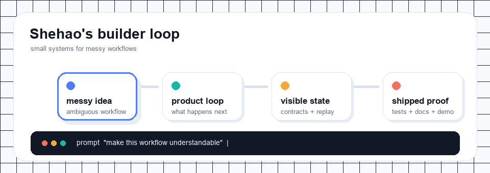

<h1 align="center">Shehao Li</h1>

  <strong>Product-minded builder at UCSD Math-CS.</strong> 
  I turn messy workflows into small systems with visible state.

  AI product loops · frontend systems · instrument automation · product taste

  
  
  

  

---

## Tiny Note

I like software that shows its work: what changed, where the state lives, what the AI is allowed to do, and how a user can replay or trust the result.

Currently I am closest to the intersection of **product judgment**, **frontend experience**, and **system implementation**. I care less about adding more features and more about making the core loop feel clear.

## Shipped Signals

| Project | What it is | Small proof |
| --- | --- | --- |
| [**Tiny Stories / RPG_Demo**](https://github.com/lishehao/RPG_Demo) | AI narrative runtime: seed -> play -> inspect -> replay. | React + FastAPI, typed contracts, reviewer mode, release gate, public demo. |
| [**Auto Load-Off Test**](https://github.com/lishehao-ctrl/Auto-Load-off-Test) | Desktop tool for repeated AWG/oscilloscope sweep measurement work. | Python + PyVISA/SCPI, 30 hardware-free tests, CI, docs, about 75% less setup/result organization effort. |

## How I Build

- Start from a real workflow, not a feature list.
- Make state visible before making the UI flashy.
- Keep AI inside clear boundaries: context, permissions, logs, replay.
- Ship small demos that can be inspected by another person.

## Current Focus

Building portfolio-ready systems around AI product workflows, reliable automation, and interactive tools that make complex systems feel easier to control.

  Python · TypeScript · React · FastAPI · SQLite · PyVISA/SCPI · LLM workflows

