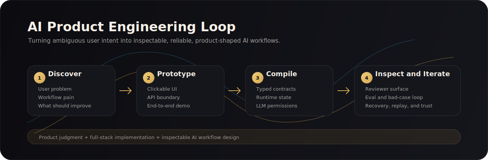
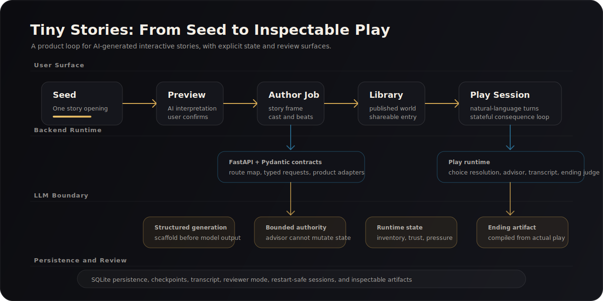
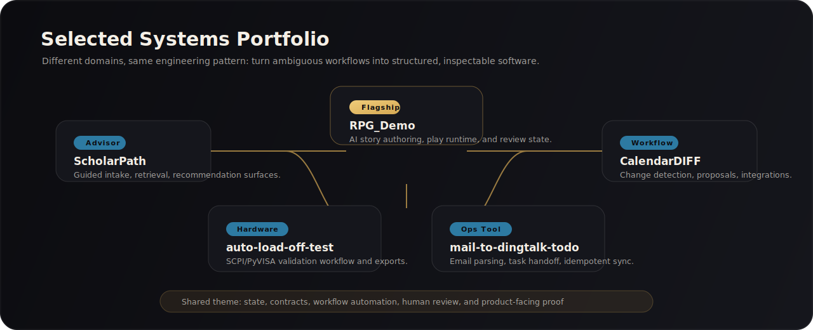

  

<h1 align="center">Shehao Li</h1>

  <strong>AI product engineer building inspectable workflow systems.</strong>

  UCSD Math-CS | full-stack AI products | stateful LLM workflows | product-quality demos

  
  
  

---

## What I Build

I build AI products where the model is not treated as a black box. My projects usually follow the same pattern:

> messy user intent -> structured state -> product interface -> runtime boundary -> evaluation and recovery

The goal is not only to make an AI demo work once. The goal is to make it **inspectable, replayable, and product-shaped** enough that another person can understand what happened and why it matters.

---

## Flagship: Tiny Stories

Tiny Stories is a full-stack AI narrative product. A user writes a short story seed, the system previews how the AI interpreted it, compiles it into a playable world, publishes it into a library, and lets players act through natural-language turns.

  

| Layer | What it proves |
| --- | --- |
| **Product loop** | Seed -> preview -> author job -> publish -> play -> ending, with user-visible checkpoints instead of a one-shot generator. |
| **Frontend surface** | React + TypeScript UI for creation, story library, play sessions, replay, and state/review panels. |
| **Backend runtime** | FastAPI + Pydantic contracts, SQLite persistence, auth/session handling, and typed frontend/backend API boundaries. |
| **LLM workflow** | Structured generation, bounded advisor behavior, deterministic scaffolding before model calls, and runtime state carried across turns. |
| **Reviewability** | State, choices, consequences, transcript, and ending output are exposed so the system can be inspected after play. |

**Links:** [Repository](https://github.com/lishehao/RPG_Demo) | [Demo](https://lishehao.github.io/RPG_Demo/) | [Product site](https://rpg.shehao.app)

---

## Selected Systems

  

| Project | System Type | What I Owned / Built |
| --- | --- | --- |
| [**RPG_Demo**](https://github.com/lishehao/RPG_Demo) | AI narrative product | Full-stack author -> publish -> play loop, LLM runtime contracts, frontend product surface, state/review experience. |
| [**ScholarPath**](https://github.com/lishehao/ScholarPath) | AI advising and decision system | Guided intake, recommendation surfaces, semantic retrieval, and application-decision workflow logic. |
| [**CalendarDIFF**](https://github.com/lishehao/CalendarDIFF) | Workflow automation engine | Deadline-change detection, review proposals, integration contracts, and operational change-tracking. |
| [**auto-load-off-test**](https://github.com/lishehao/auto-load-off-test) | Instrument automation | Python desktop workflow for AWG/oscilloscope-style validation, SCPI/PyVISA control, exports, and test repeatability. |
| [**mail-to-dingtalk-todo**](https://github.com/lishehao/mail-to-dingtalk-todo) | Operations automation | IMAP parsing, structured task extraction, DingTalk task creation, idempotency, and internal workflow handoff. |

---

## Working Thesis

AI is making simple implementation cheaper. That makes the surrounding system more important:

- What user problem is worth automating?
- What state should the product remember?
- What is the model allowed to change?
- How do users inspect, undo, replay, and trust the result?
- How does the team know whether the workflow got better?

That is the space I like building in: **product judgment + full-stack implementation + reliable AI workflow design**.

---

## Stack

  
  
  
  
  
  
  

---

## Current Focus

I am currently building portfolio-ready AI systems that combine:

- **real product surfaces** users can try,
- **typed backend contracts** reviewers can inspect,
- **LLM boundaries** that keep generation accountable,
- **workflow evidence** showing how the product improves over iterations.
