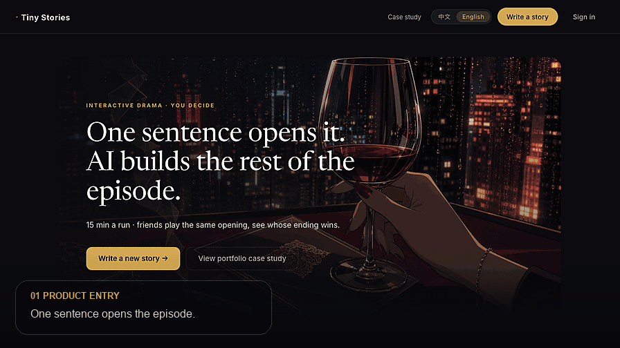
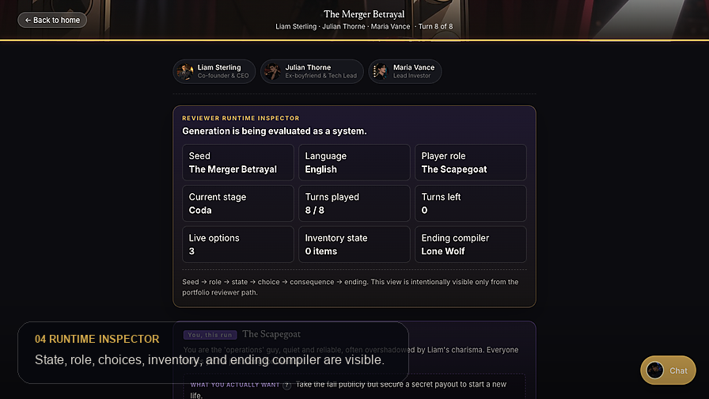

<h1 align="center">Shehao Li</h1>

  <strong>I build AI workflow systems with visible state, typed contracts, and product loops people can actually use.</strong>

  UCSD Math-CS | AI products | full-stack systems | workflow automation

  
  
  

---

  

| What I care about | Evidence in shipped work |
| --- | --- |
| **AI product loops** | Seed -> compile -> play -> inspect, with user-visible checkpoints instead of one-shot generation. |
| **Reliable workflow systems** | Typed API boundaries, persisted state, replayable outputs, and task handoff surfaces. |
| **Human-centered control** | Interfaces that show what changed, what the AI is using, and where the user can steer. |

---

## What I Build

I build products that make complicated workflows easier to run, inspect, and improve. This page focuses on work that is already shipped or substantially complete:

- **RPG_Demo / Tiny Stories**, a full-stack AI narrative product where a story seed becomes a playable, inspectable runtime.
- **Auto Load-Off Test**, a Python instrumentation workflow that turned repeated AWG/oscilloscope-style validation work into a repeatable desktop tool.

The common thread is simple: I like turning ambiguous product or operations problems into software with clear interfaces, state, logs, and user-visible checkpoints.

---

## Flagship: RPG_Demo / Tiny Stories

**RPG_Demo** is the implementation repo; **Tiny Stories** is the product experience inside it. A user writes a story seed, previews how the system interprets it, publishes it into a library, plays through natural-language turns, and reviews the ending with state, consequences, and transcript evidence still visible.

  

| Layer | What it proves |
| --- | --- |
| **Product loop** | Seed -> preview -> publish -> play -> review, with user-visible checkpoints instead of a one-shot generator. |
| **Frontend surface** | React + TypeScript UI for creation, story library, play sessions, replay, and state/review panels. |
| **Backend runtime** | FastAPI + Pydantic contracts, SQLite persistence, auth/session handling, and typed frontend/backend API boundaries. |
| **LLM workflow** | Structured generation, bounded advisor behavior, deterministic scaffolding before model calls, and runtime state carried across turns. |
| **Reviewability** | State, choices, consequences, transcript, and ending output are exposed so the system can be inspected after play. |

**Links:** [Repository](https://github.com/lishehao/RPG_Demo) | [Demo](https://lishehao.github.io/RPG_Demo/) | [Product site](https://rpg.shehao.app)

---

## Auto Load-Off Test

During my instrument-company internship, I built a Python desktop automation tool for repeated lab validation work. It is less flashy than an AI demo, but it shows the part of engineering I care about: making repeated real-world work reliable enough for other people to use.

| Project | What it automated | Evidence |
| --- | --- | --- |
| [**auto-load-off-test**](https://github.com/lishehao/auto-load-off-test) | AWG/oscilloscope-style sweep measurement and calibration workflow with PyVISA/SCPI control, Tkinter UI, structured outputs, and layered architecture. | Reduced test preparation and result organization effort by about **75%**; supported about **5 users**; includes tests for sweep planning, measurement IO, settings, and task flow. |

---

## Selected Projects

| Project | System Type | What I Owned / Built |
| --- | --- | --- |
| [**RPG_Demo**](https://github.com/lishehao/RPG_Demo) | AI narrative product | Full-stack author -> publish -> play loop, LLM runtime contracts, frontend product surface, state/review experience. |
| [**auto-load-off-test**](https://github.com/lishehao/auto-load-off-test) | Instrument automation | Python desktop workflow for AWG/oscilloscope-style validation, SCPI/PyVISA control, exports, and test repeatability. |
| [**ScholarPath**](https://github.com/lishehao/ScholarPath) | AI advising and decision system | Guided intake, recommendation surfaces, semantic retrieval, and application-decision workflow logic. |

---

## Working Thesis

AI is making simple implementation cheaper. That makes product judgment and surrounding workflow design more important:

- What user problem is worth automating?
- What state should the product remember?
- What is the model allowed to change?
- How do users inspect, undo, replay, and trust the result?
- How does the team know whether the workflow got better?

That is the space I like building in: **product judgment + full-stack implementation + reliable workflow design**.

---

## Stack

  
  
  
  
  
  
  
  

---

## Current Focus

I am currently building portfolio-ready systems that combine:

- **AI product surfaces** users can try,
- **typed backend contracts** reviewers can inspect,
- **automation workflows** that reduce repeated manual work,
- **evidence and logs** showing what happened and why.

I am also exploring newer agent-product work through an ongoing internship, but I keep this profile centered on completed projects until those results are mature enough to stand on their own.
