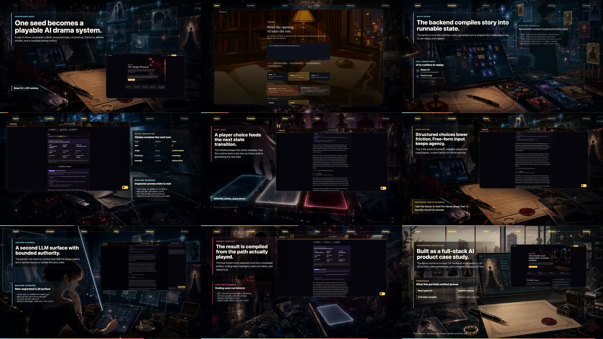

  

<h1 align="center">Shehao Li</h1>

  <strong>AI product engineer building inspectable LLM systems.</strong>

  I build full-stack AI products where the model is not a black box:
  typed contracts, runtime state, reviewer surfaces, and polished demos.

  
  

---

## Featured Work

### Tiny Stories

An inspectable AI drama runtime: one seed becomes a playable 12-turn story with
roles, persistent state, advisor context, free-form action, and a compiled ending.

  

| Surface | What it proves |
| --- | --- |
| **Live demo** | A portfolio-ready GitHub Pages video with native playback and narration. |
| **Full-stack runtime** | React UI, FastAPI backend, SQLite persistence, and typed frontend/backend contracts. |
| **LLM system design** | Deterministic scaffolding before generation, role-separated LLM calls, and bounded advisor authority. |
| **Reviewer mode** | Inspectable state surfaces for seed, role, stage, options, inventory, advisor context, and ending output. |

**Links:** [Live demo](https://lishehao.github.io/RPG_Demo/) · [Repository](https://github.com/lishehao/RPG_Demo)

---

## What I Build

| Area | Focus |
| --- | --- |
| **AI product prototypes** | Turning ambiguous product ideas into playable, inspectable demos. |
| **LLM workflow systems** | Designing around state, contracts, boundaries, evaluation, and recovery paths. |
| **Full-stack applications** | React, TypeScript, Python, FastAPI, persistence, and deployment workflows. |
| **Portfolio-grade presentation** | Demo videos, visual systems, README architecture, and reviewer-friendly proof. |

---

## Working Style

- I care about AI products that can be inspected, replayed, and evaluated.
- I prefer small, complete systems over broad demos that only work in a trailer.
- I design the product loop, the engineering boundary, and the presentation layer together.

---

## Stack

  
  
  
  
  

---

## Current Focus

Building portfolio-ready AI systems that show both product taste and engineering
control: what the user experiences, what the model is allowed to do, and what a
reviewer can verify afterward.
